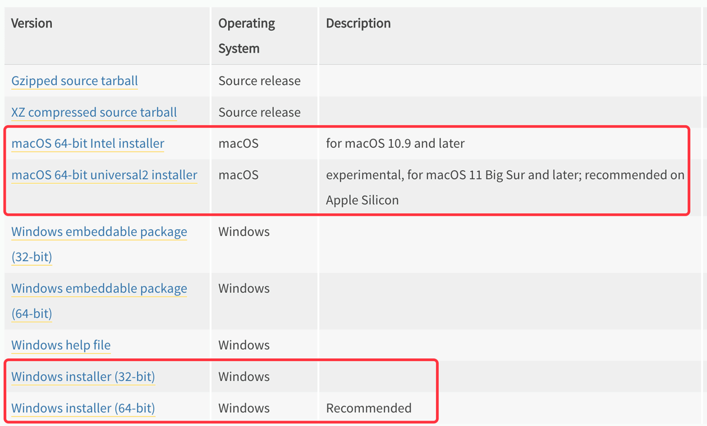
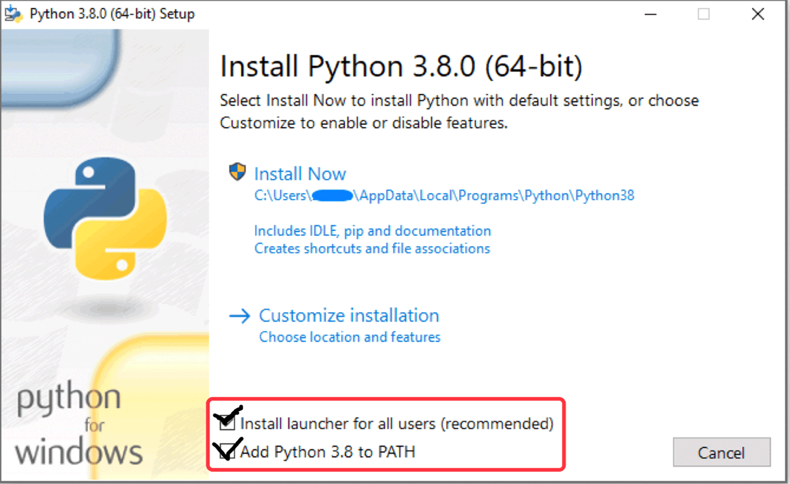

# 环境搭建

**目录**

[[toc]]

:::tip 提示
如果你尚未搭建过自己的 Python 工作环境，推荐参考如下流程。如果你已经有自己熟悉的 Python 工作环境，可以跳过本节。
:::

::: danger 注意
请大家在第二周首次上课前完成环境搭建。如有问题，请在课程微信群中及时提出。
:::

## Step 1. 安装 Python 3

:::tip 提示
考虑到兼容性、稳定性、性能等因素，我们推荐使用 Python 3.8.10 作为本课程的开发环境，本课程的所有代码均在该版本下测试通过。

当然，如果你想用其他的 Python 3.x 版本，也可以在 [Python 官网](https://www.python.org/) 自行下载安装。
:::

:::warning 注意
如果你有兴趣，也可以使用 Anaconda、MiniConda、Virtualenv、Pipenv 等 Python 虚拟环境管理工具来管理你的 Python 3 环境。但是，对于初学者而言，我们推荐直接在官网下载安装 Python 3.8.10 安装包后，按照下面的教程步骤安装。
:::

首先打开网址：[https://www.python.org/downloads/release/python-3810/](https://www.python.org/downloads/release/python-3810/)

然后，将网页下拉到 `Files` 部分。

<!--  -->

  

:::tip 提示
① Mac 需查看电脑芯片和系统版本，如为 Intel 芯片且系统版本高于 10.9，可选截图红框中第一个；若使用 Apple M1 芯片且系统版本高于 11，则选红框中的第二个。

② Windows 系统需检查是 32 位操作系统还是 64 位，据此选择红框中的 Windows installer 32-bit 或 64-bit 版。

③ 如下图所示，Windows 系统安装时请务必勾选 “add Python to PATH” 选项

<!--  -->

  

:::

## Step 2. 安装集成开发环境

:::tip 提示
我们认为 Pycharm 是目前最好的 Python 集成开发环境（IDE），所以我们推荐使用 Pycharm 作为本课程的开发环境。

一般来说，我们用 Pycharm 来管理我们的 Python 项目并编写代码。
:::

进入 Jetbrains 官网：[https://www.jetbrains.com/pycharm/](https://www.jetbrains.com/pycharm/)，按照提示下载安装即可。

:::tip 提示
① 选择与电脑系统适配的版本（Windows/Mac OS）。

② 选择免费的 Community 社区版。

③ 如果你时间充裕，可以以学生身份申请教育优惠，然后激活使用 Professional 专业版。网上有很多相关教程，这里不再赘述。
:::

  

## Step 3. 安装文本编辑器

:::warning 提示
因为系统自带的文本编辑器（如 Windows 下的记事本）功能较弱，不适合浏览及编写代码，所以我们推荐使用功能更强大的文本编辑器。
:::

有时候，你可能只是想简单浏览一下代码，编写一些简单的代码片段，或者查看一下某个文本文档的内容，这时你可以使用一个专业的文本编辑器。相比庞大的 PyCharm，文本编辑器更加轻量级，更加适合这种场景。

Windows 系统：推荐 [Visual Studio Code](https://code.visualstudio.com/)、[EmEditor](https://www.emeditor.com/) 或 [Sublime Text](https://www.sublimetext.com/)。

Mac OS 系统：推荐 [Visual Studio Code](https://code.visualstudio.com/)、[TextMate](https://macromates.com/) 或 [Sublime Text](https://www.sublimetext.com/)。

:::tip 提示
安装完成后，建议将安装的文本编辑器设为 `txt` 类型文件打开的默认程序。
:::
